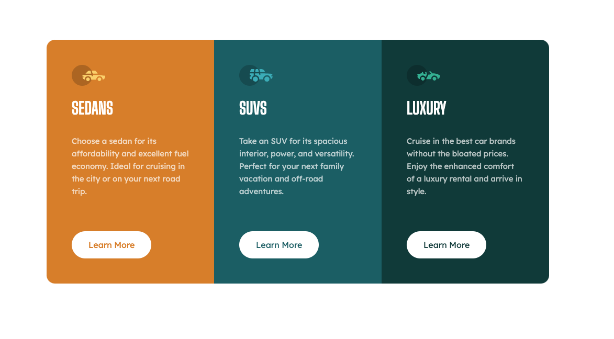
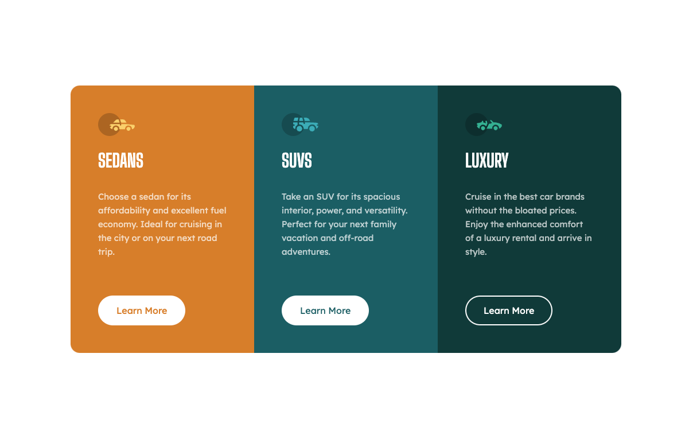
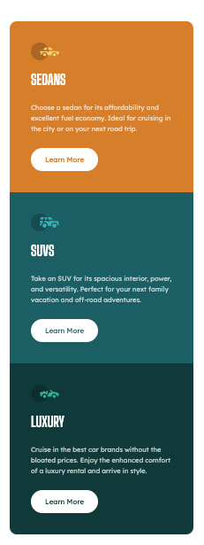

# Frontend Mentor - 3-column preview card component solution

This is a solution to the [3-column preview card component challenge on Frontend Mentor](https://www.frontendmentor.io/challenges/3column-preview-card-component-pH92eAR2-). Frontend Mentor challenges help you improve your coding skills by building realistic projects.

### The challenge

Users should be able to:

- View the optimal layout depending on their device's screen size
- See hover states for interactive elements

### Screenshot





### Links

- [Solution](https://www.frontendmentor.io/solutions/3column-preview-card-component-solution-UtknQhU3gJ)
- [Live Site](https://sparkling-jalebi-987783.netlify.app/)

### What I learned

- You can use the ```currentColor``` to inherit the parent's color property if you do not currently have a color set to your child selector (useful if you want to use the value of the parent's color property on something other than color)
