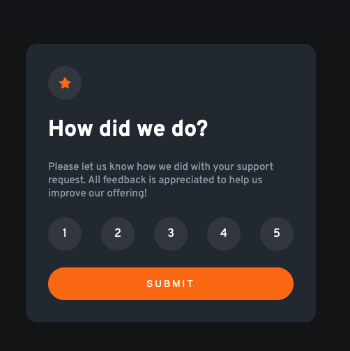

# Frontend Mentor - Interactive rating component solution

This is a solution to the [Interactive rating component challenge on Frontend Mentor](https://www.frontendmentor.io/challenges/interactive-rating-component-koxpeBUmI). Frontend Mentor challenges help you improve your coding skills by building realistic projects.

### The challenge

Users should be able to:

- View the optimal layout for the app depending on their device's screen size
- See hover states for all interactive elements on the page
- Select and submit a number rating
- See the "Thank you" card state after submitting a rating

### Screenshot




### Links

- [Solution](https://www.frontendmentor.io/solutions/interactive-rating-component-with-js-tKFVTf4niZ)
- [Live Site](https://lucent-sunburst-ea6afd.netlify.app/)

### What I learned

- Set ```overflow-x``` property to ```hidden``` to disable x scroll if you have hidden horizontal properties
- Use ```radio``` for inputs that need to be exclusive and wrap it in ```forms``` so that the data can be submitted <em>(shout out to [@Valentine-D3V](https://github.com/Valentine-D3V) for the feedback on FEM)</em>.

### Continued development

- Add a reset button at the result screen
- Recreate this design with react
